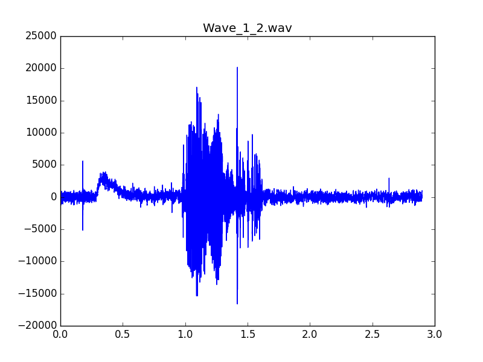
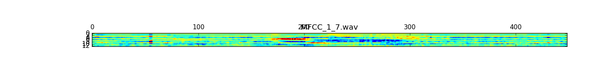

# README

### Aim

利用CNN卷积神经网络，用自己的音频.wav文件作为训练集，完成语音指令集的识别。在本程序中完成了4个指令的识别：go forward|go back|turn left|turn right , 每个指令有40个音频数据用作训练CNN网络。

### Requirement

python 2.7

tensorflow 1.8.0

scipy

sklearn

python_speech_features

pyaudio

### Run

##### 录制音频

运行`stop_record.py`，录制音频

音频的命名规则：

`a_b.wav`：a是语音命令的种类代号，从1开始，b是a种指令的第b个文件，b不会被读入程序，只是为了区分不同文件

修改`stop_record.py`的main部分：

```python
if __name__ == "__main__":
    for i in range(0,40):
        rec = Recorder()
        print ("Prepare %d..."%i)
        time.sleep(1)
        rec.record("4_%d.wav"%i) # 录制40个4_i.wav文件
```


录制音频分配到不同文件夹：

```
/data
	--/	xunlian (训练集)
	--/ test_data (测试集)
	--/ isnot_test_path (验证集)
```

其中，训练集和测试集均会在训练时用到，建议训练集数据量是测试集3倍


对录制音频文件的时间、声道个数的修改详见`Detail`文件。


##### 训练CNN网络

运行`yuyin.py`，该文件有三个主函数，每次只能运行其中一个运行，只要修改程序末尾部分的注释即可：

```python
if __name__ == '__main__':

    xunlianlo(path,test_path)

    # xunlian_continue(path, test_path)

    # test_main(isnot_test_path)
```

三个主函数的功能如下：

| 函数名                                     | 功能                             |
| ------------------------------------------ | -------------------------------- |
| `xunlianlo(训练集路径, 测试集路径)`        | 定义神经网络并开始训练           |
| `xunlian_continue(训练集路径, 测试集路径)` | 使用上次的神经网络继续训练       |
| `test_main(验证集路径)`                    | 将验证集数据输入神经网络查看效果 |

训练结束后，会将训练的神经网络保存到相应路径下，此处保存在`nnx/`路径下，其中x是数字。


`xunlianlo`函数会在指定训练次数后，保存模型到如下路径：

```python
saver.save(sess, 'nn1/my_net.ckpt')
```


可以利用`xunlian_continue`函数继续加载上次训练的模型，继续训练：

```python
saver = tf.train.import_meta_graph("nn1/my_net.ckpt.meta")
saver.restore(sess, 'nn1/my_net.ckpt')
```

并重新保存：

```python
saver.save(sess, 'nn2/my_net.ckpt')
```


`test_main`函数可以指定加载保存过的模型，用于识别：

```python
saver = tf.train.import_meta_graph("nn2/my_net.ckpt.meta")
saver.restore(sess, 'nn2/my_net.ckpt')
```


如果想用自定义的数据集训练，需要先参照上一部分录制音频，由于录制的音频大小可能与原来不一致，程序中需要修改`find_matrix_max_shape`函数的返回值和网络的大小，较为复杂，详见`Detail`文件。


##### 实时识别

运行`rec_and_recog.py`，该程序会先录一段音，之后立即输出识别结果。

该程序引用了前两个部分的程序：

```python
from yuyin import test_main
from stop_record import Recorder
```

实时的录音文件保存在`/data/gym_test_path/`中，仅会保存最后一次实时录音。


##### 绘图

运行`test.py`，程序将输出`data/gym_test_path/0_0.wav`文件的音频图和MFCC图：





更多绘图函数的细节请见`Detail`文件

### Result

利用CPU训练20min，训练800次左右，准确率可达80%

由于训练样本过少，训练次数过多可能出现过拟合情况。

本程序只用了最简单的4层神经网络，只能算作一个小试验demo，如需提高准确率，还应选用更复杂的网络并配合以大量数据集。